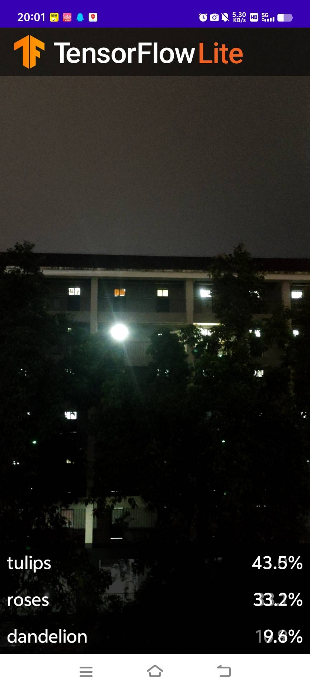

本应用是一个基于 **TensorFlow Lite** 和 **CameraX** 的安卓图像分类项目。通过集成深度学习模型，能够实现对拍摄内容的实时智能识别与分析。

## 项目简介

本项目旨在展示如何在 Android 移动端部署轻量级机器学习模型。通过调用手机摄像头实时获取画面，利用预训练的模型进行推理，从而实现高效、准确的图像分类功能。

## 主要功能

* **实时图像采集**：基于 Android CameraX API，实现流畅的摄像头画面预览。
* **端侧推理 (On-Device Inference)**：利用 TensorFlow Lite 在手机本地运行模型，无需联网，保护用户隐私且响应速度极快。
* **GPU 加速**：支持通过 GPU 代理（Delegate）加速模型推理，大幅降低延迟。
* **智能识别展示**：直观展示识别结果，并提供相应的置信度分析。

## 演示效果

## 技术栈

* **开发环境**: Android Studio
* **核心语言**: Kotlin / Java
* **机器学习**: TensorFlow Lite, Model Binding
* **图像处理**: CameraX
* **性能优化**: GPU Acceleration (OpenGL/Vulkan)

## 如何运行

1. **准备环境**: 确保使用 Android Studio 环境。
2. **获取设备**: 本项目需要连接**实体 Android 手机**进行调试（因涉及摄像头硬件调用）。
3. **配置模型**: 将 `.tflite` 模型文件放入 `assets` 目录下，并通过 Android Studio 的 ML Model Binding 自动生成接口类。
4. **编译运行**: 直接点击 Run 即可在设备上查看效果。

## 许可证

本项目采用 Apache License 2.0 开源协议。
